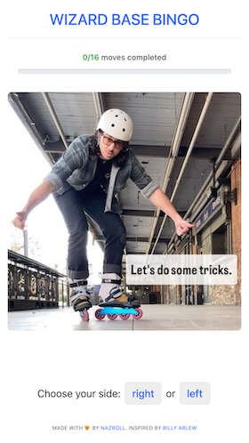
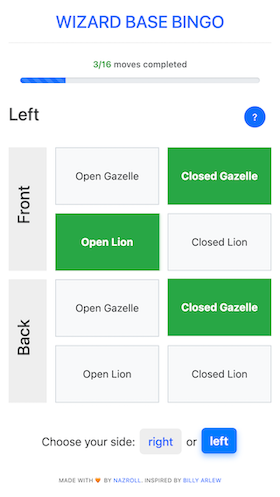
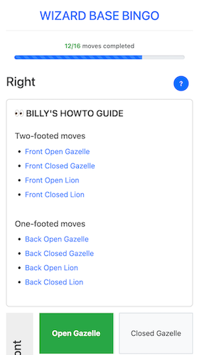
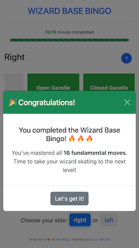

# 🧙‍♂️ Wizard Base Bingo

An interactive web application for tracking progress in learning fundamental inline skating "wizard" moves. Built as a gamified bingo-style tracker to help skaters master the essential moves.






## 🎯 Features

- **Interactive Bingo Grid**: Click to mark moves as completed across 16 fundamental moves.
- **Progress Tracking**: Real-time progress bar with localStorage persistence.
- **Dual Leg &amp; Position-Based Support**: Separate tracking for right and left leg, front and back position.
- **Visual Guides**: Direct links to Billy Arlew's instructional content.
- **Responsive Design**: Mobile-friendly interface with Bootstrap 5.
- **Celebration Effects**: Confetti animation and congratulations modal on completion.
- **Persistent State**: Your progress is automatically saved and restored in-device.

## 🏗️ Technical Stack

- **Frontend**: HTML5, CSS3, JavaScript (ES6+)
- **Styling**: Bootstrap 5.3.6
- **Icons & Effects**: Custom CSS animations, emoji-based UI
- **Storage**: localStorage for progress persistence
- **Dependencies**: jQuery 3.5.1, Bootstrap Bundle

## 🎮 How to Use

1. **Choose Your Side**: Start by selecting right or left leg from the home screen
2. **View Guides**: Click the "?" button to access Billy's instructional links
3. **Track Progress**: Click on any trick box to mark it as completed
4. **Monitor Progress**: Watch the progress bar fill as you complete moves
5. **Celebrate**: Enjoy confetti and congratulations when you complete all 16 tricks!

## 📋 Trick Categories

The app tracks **16 total moves** organized as:

### Gazelle Moves
- **Open Gazelle** (Front & Back positions)
- **Closed Gazelle** (Front & Back positions)

### Lion Moves  
- **Open Lion** (Front & Back positions)
- **Closed Lion** (Front & Back positions)

Each category includes:
- **Two-footed moves** (Front position)
- **One-footed moves** (Back position)
- **Both legs** (Right & Left)

## 🚀 Getting Started

You can start using the app here: https://nazroll.com/rockerdapp/.

If you want to host your own instance, follow the steps below.

### Quick Start
1. Clone the repository:
   ```bash
   git clone https://github.com/yourusername/wizard-base-bingo.git
   cd wizard-base-bingo
   ```

2. Open `index.html` in your web browser, or serve it locally:
   ```bash
   # Python 3
   python3 -m http.server 8000
   
   # Node.js (if you have http-server installed)
   npx http-server
   
   # PHP (if available)
   php -S localhost:8000
   ```

3. Navigate to `http://localhost:8000` and start tracking your progress!

### No Installation Required
You can also run this directly by opening `index.html` in any modern web browser.

## 🎨 Project Structure

```
/
├── index.html          # Main application file
├── bingo.js           # Application logic and interactions
├── bingo.css          # Custom styling and animations
├── billy.jpg          # Hero image and favicon
├── billy-intro.png    # Additional assets
├── LICENSE            # Apache 2.0 License
└── README.md          # This file
```

## 🔧 Customization

The application is built with modularity in mind:

- **Tricks Data**: Modify `tricksData` object in `bingo.js` to add/change tricks
- **Styling**: Update `bingo.css` for visual customizations
- **Progress Logic**: Adjust completion criteria in the progress calculation functions
- **Links**: Update tutorial URLs in the `tricksData` object

## 🔗 Educational Resources

This app integrates with Billy Arlew's comprehensive inline skating tutorials:
- [Eccentric Inline](https://eccentricinline.com/) - Additional advanced techniques

### Tutorial Links Include:
- Front Open Gazelle, Front Closed Gazelle
- Front Open Lion, Front Closed Lion  
- Back Open Gazelle, Back Closed Gazelle
- Back Open Lion, Back Closed Lion

## 🤝 Contributing

Contributions are welcome! Please feel free to submit a Pull Request. Areas for improvement:

- Additional trick categories
- Enhanced animations and effects
- Mobile app version (PWA)
- Multi-language support
- Advanced statistics and analytics
- Social sharing features
- Export/import progress data

### Development Guidelines
1. Fork the repository
2. Create a feature branch (`git checkout -b feature/amazing-feature`)
3. Commit your changes (`git commit -m 'Add amazing feature'`)
4. Push to the branch (`git push origin feature/amazing-feature`)
5. Open a Pull Request

## 📱 Browser Support

- **Chrome** 80+
- **Firefox** 75+
- **Safari** 13+
- **Edge** 80+
- **Mobile browsers** (iOS Safari, Chrome Mobile)

## 🚀 Performance Features

- Debounced save operations for smooth performance
- localStorage caching for instant load times
- Responsive design optimized for all screen sizes
- Lazy loading for external tutorial links
- Efficient DOM manipulation with jQuery

## 📄 License

This project is licensed under the Apache License 2.0 - see the [LICENSE](LICENSE) file for details.

## 🙏 Acknowledgments

- **Billy Arlew** - For the comprehensive wizard skating tutorials and inspiration

## 🏷️ Version

**Current Version**: 1.0.0

## 📧 Contact

Created by [nazroll](https://nazroll.com) - feel free to reach out!

---

*Keep skating and keep practicing those wizard moves!* ✨